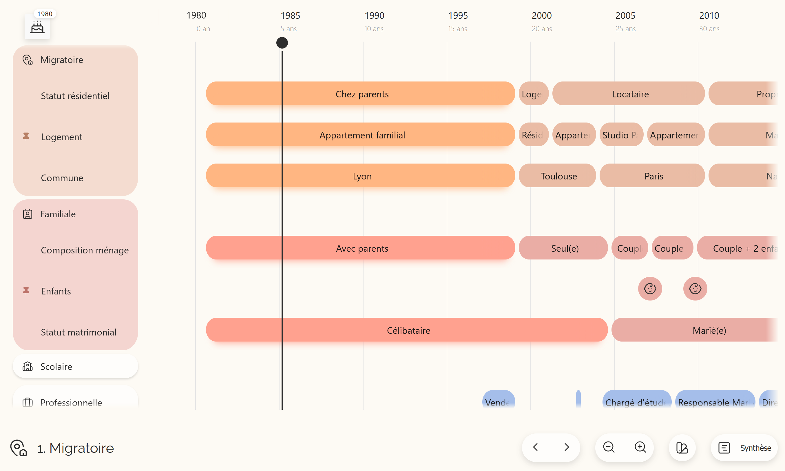

# Life Stories

A hybrid mobile application for collecting life history data with real-time synchronization between interviewer and interviewee using WebRTC.



## Installation and Setup

1. Clone the repository:
   ```bash
   git clone
   ```
2. Install packages:
   ```bash
   npm install
   ```
3. Start a local development server:
   ```bash
   npm start
   ```
4. Build the app with Capacitor for your target platform:
   ```bash
   npm run build
   npx cap sync
   npx cap open android # or ios 
   ```
5. View CSS changes without reloading:
   Use the "Go Live" extension in VS Code (note: only shows dev mode container, not onboarding process).

6. Debug on Android device:
   Plug in the device and use `chrome://inspect` to view console logs and debug.

## Known Issues & Workarounds

- **Live reload on tablet**: Live reload doesn't work on the campus WiFi. Workaround: Use your phone as a hotspot and update the server URL to your phone's IP address in `capacitor.config.json`:
  ```json
  "server": {
    "url": "http://192.168.1.68:8100",
    "cleartext": true
  }
  ```


## Project Structure

This project is mainly coded using pure JavaScript but some components where created using React as a mean to clean up and simplify the project. To allow React and Javascript to run, we created files called "bridges" that connect the components to the html file. 

Since this is a project that runs offline, libraries and fonts should be downloaded as has been the case here.

### Core Files (src/js)

- **`dataset.js`** - Sample test data and fixtures for development
- **`state.js`** - Centralized application state management
- **`utils.js`** - Utility functions (alerts, formatting, helpers)
- **`swipeDetector.js`** - Touch gesture detection for swipe actions

### QR Code Module (src/js/qrcode)

- **`qr-scan.js`** - Camera access and QR code detection for device pairing
- **`qr-gen.js`** - QR code generation for sharing connection info
- **`qrcode.min.js`** - Third-party QR code library (minified)

### Episodes Module (src/js/episodes)

- **`episodes.js`** - Episode list management and retrieval
- **`episodeEdit.js`** - Episode editing and CRUD operations

### Questionnaire Module (src/js/questionnaire)

- **`questionnaire.js`** - Main questionnaire flow and rendering
- **`eventHandlers.js`** - User interaction handlers for form inputs
- **`questionConfig.js`** - Question definitions and configuration
- **`choicesQuestions.js`** - Multiple choice and dropdown questions
- **`inputQuestion.js`** - Text/number input questions
- **`inputListQuestion.js`** - Questions with list inputs
- **`renderPairedStatusDropdowns.js`** - UI for paired status selection
- **`renderPairedYearAgeInputs.js`** - UI for year/age input pairs
- **`historyDisplay.js`** - Display of survey response history
- **`resetHandler.js`** - Reset questionnaire state
- **`webrtcSync.js`** - Sync questionnaire responses via WebRTC

### State Machine Module (src/js/stateMachine)

- **`stateMachine.js`** - XState state machine definition and flow
- **`context.js`** - State machine context (data store)
- **`actions.js`** - State transition actions
- **`guards.js`** - Conditional guards for state transitions
- **`stateToQuestionMap.js`** - Maps state to corresponding question
- **`persistence.js`** - Save/restore state machine state

### WebRTC Module (src/js/webrtc)

- **`webrtc-onboarding.js`** - Peer connection setup and device pairing flow
- **`webrtc-sync.js`** - Real-time data synchronization between devices

### Timeline Module (src/js/timeline)

- **`timeline.js`** - Main timeline initialization and event coordination
- **`timelineInit.js`** - Timeline setup and initialization
- **`timelineData.js`** - Groups and data definitions for timeline
- **`timelineConfig.js`** - Timeline configuration options
- **`timelineEvents.js`** - Timeline event handlers (add, edit, delete items)
- **`timelineInteractions.js`** - User interactions (clicks, long-press, gestures)
- **`timelineUtils.js`** - Helper functions for timeline operations
- **`timelineStorage.js`** - localStorage persistence for timeline data
- **`timelinePersistence.js`** - Auto-save listeners and debouncing
- **`timelineState.js`** - Timeline state tracking
- **`birthYear.js`** - Birth year calculation and reference bar
- **`verticalBar.js`** - Custom vertical reference bar visualization
- **`dragHandlers.js`** - Drag and drop functionality
- **`zoomNavigation.js`** - Zoom and pan navigation controls
- **`summaryUtils.js`** - Summary/stats display for timeline
- **`chapterToggle.js`** - Show/hide chapter titles toggle
- **`landmarkUtils.js`** - Long-press landmarks (key events) on timeline
- **`gapDetection.js`** - Detect and visualize missing periods
- **`overlapDetection.js`** - Detect and mark overlapping episodes
- **`importExportUtils.js`** - Export/import timeline data

## Functionalities 

### Dev Tools

The app includes developer tools for testing purposes:
- Hide the onboarding phase
- Hide offer and answer text (avoid manual CSS commenting before tablet builds)
- Delete localStorage and reload the app for both users
- Load tand visualizes gaps or overlaps between episodes. Alerts are color-coded and stored in a button (interviewer only) to review and address inconsistencies

### Gaps and Overlaps

Detects gaps or overlaps between episodes, shows an alert (color coded) and store them in a button available only for the interviewer. It allows him to go over the alerts and act on it.

### Export

Downloads the interview's data as a JSON file. Available only on the interviewer's side.

### Navigation and Summary

Accessibility buttons allow users to navigate and zoom the timeline. A summary button displays a snapshot of the selected year. Navigate by dragging the vertical bar over episodes or clicking specific dates.

### Birth Year

Displays birth year and allows users to zoom out and navigate to the timeline's start.

### Chapters

Chapters can be collapsed vertically or horizontally to save space. Long-press an attribute to pin it, which shows only that attribute's elements when the chapter is closed.


## Views

### Onboarding

Users select their role (interviewer or interviewee) and begin the connection process. After scanning each other's QR codes, users are redirected to their respective pages (dashboard and timeline). The WebRTC phase saves the user role to localStorage. 

### Interviewer's pages

#### Sidebar

Navigate between different pages:
- **Dashboard** - Overview (see Figma for design ideas)
- **Questionnaire** - Questions only
- **Calendar** - Timeline only
- **Split View** - Questions and timeline combined

Note: Views are implemented by toggling visibility of page sections.

#### Questionnaire

View and answer questions, access question history when disconnected, edit answers, export interview data, review gaps and overlaps, and manually add episodes or events. 

#### Calendar

Interviewers can view the timeline and edit episodes or events by long-pressing them.

#### Split View

View both questions and timeline side by side.

### Interviewee's Pages

Interviewees can only view the timeline. All timeline editing functionality is disabled for this role.

## Resources & Documentation

 ### Figma Designs

- **[Final Design](https://www.figma.com/design/dMe4ZYdj6tKyLolA9hcaxL/LifeStories?m=auto&t=3o3vvwr3PZr7xfjH-1) ** - Production-ready UI and components
- **[Brainstorming](https://www.figma.com/board/v9qDByOj3HOAcwidoQvg82/LifeStories---Final?t=3o3vvwr3PZr7xfjH-1)** - Initial concepts and ideas
- **[Brainstorming & Process](https://www.figma.com/board/ZBvi9S5uDuBLEaXsL6mnD6/LifeStories?node-id=0-1&t=3o3vvwr3PZr7xfjH-1)** - Design iterations and process documentation

- **[Database Schema (DBDiagram)](https://dbdiagram.io/d/LifeStories-updated-690a046a6735e111702ffddc)** - Data model and relationships
- **[Tasks & Roadmap (Whimsical)](https://whimsical.com/tasks-34iLabHiqveUoGJ3t1k46R)** - Development tasks and timeline
